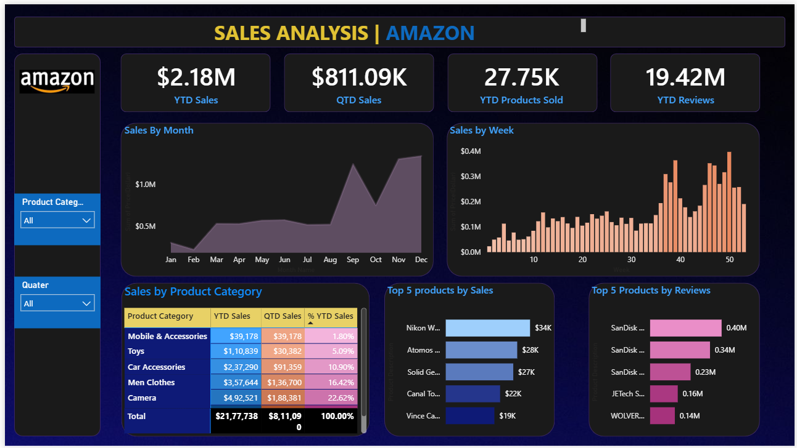

# 📊 Amazon Sales Analysis Dashboard | Power BI

An interactive **Amazon Sales Analysis Dashboard** built using **Microsoft Power BI** to analyze sales performance, product performance, customer reviews, and sales trends.

---

## 📌 Dashboard Preview



---

## 📖 Project Overview

This project focuses on analyzing Amazon product sales data using Microsoft Power BI.

The dashboard provides an interactive view of key business metrics such as **YTD Sales, QTD Sales, Products Sold, Customer Reviews, monthly sales trends, weekly sales trends, product category performance, and top-performing products**.

The goal of this project is to transform raw sales data into meaningful visual insights that can help understand product performance and overall sales trends.

---

## 🎯 Objectives

The main objectives of this dashboard are:

- Analyze overall sales performance.
- Track Year-to-Date (YTD) sales.
- Track Quarter-to-Date (QTD) sales.
- Analyze the number of products sold.
- Analyze customer reviews.
- Identify monthly sales trends.
- Identify weekly sales trends.
- Compare sales performance across product categories.
- Identify the top 5 products based on sales.
- Identify the top 5 products based on customer reviews.
- Provide interactive filtering for better data exploration.

---

## 📊 Key Performance Indicators (KPIs)

The dashboard includes the following KPIs:

| KPI | Description |
|---|---|
| 💰 YTD Sales | Total sales generated Year-to-Date |
| 💰 QTD Sales | Total sales generated Quarter-to-Date |
| 📦 YTD Products Sold | Total number of products sold Year-to-Date |
| ⭐ YTD Reviews | Total customer reviews Year-to-Date |

---

## 📈 Dashboard Features

### 1. Sales by Month

Visualizes the monthly sales trend throughout the year and helps identify:

- High-performing months
- Low-performing months
- Changes in sales over time
- Overall sales trends

### 2. Sales by Week

Displays weekly sales performance and helps identify:

- Weekly sales fluctuations
- High-performing weeks
- Sales peaks
- Changes in sales patterns

### 3. Sales by Product Category

Provides a detailed comparison of product categories based on:

- YTD Sales
- QTD Sales
- Percentage of YTD Sales

This helps identify which product categories contribute the most to overall sales.

### 4. Top 5 Products by Sales

Highlights the five products generating the highest sales.

This allows easy identification of the best-performing products.

### 5. Top 5 Products by Reviews

Displays the five products with the highest number of customer reviews.

This provides an indication of product popularity and customer engagement.

### 6. Interactive Filters

The dashboard includes interactive filters for:

- Product Category
- Quarter

These filters allow users to dynamically explore the dashboard based on their selected criteria.

---

## 🛠️ Tools & Technologies

The following tools and technologies were used to develop this project:

- **Microsoft Power BI**
- **Power Query**
- **DAX**
- **Microsoft Excel**
- **Data Visualization**
- **Data Cleaning & Transformation**
- **Data Analysis**

---

## 🔄 Data Analysis Process

The project followed the following workflow:

```text
Raw Dataset
     ↓
Data Cleaning
     ↓
Data Transformation
     ↓
Data Modeling
     ↓
DAX Calculations
     ↓
Data Visualization
     ↓
Interactive Dashboard